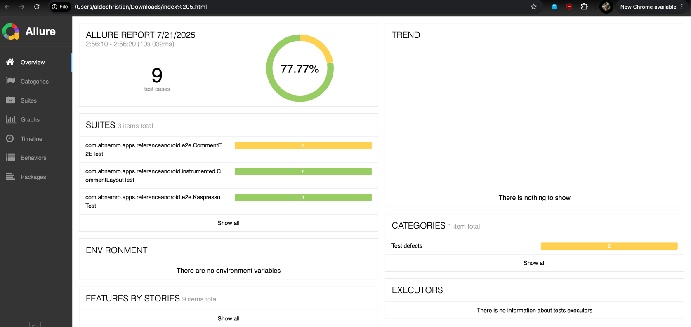

# 📱 BUUT Assessment Application

This application built with **Jetpack Compose**, **Ktor**, and robust tooling for quality, testing, and CI. This app is designed with modern development practices using **Java 21**, **Kotlin DSL**, **Compose UI testing**, **Kaspresso**, **Allure reports**, **SonarQube**, and **GitHub Actions** for automation.


---

## 🧩 Project Highlights

- 🧱 **Jetpack Compose** – Declarative UI development.
- 🔌 **Ktor Client** – Asynchronous REST API calls.
- 🧪 **Kaspresso** – Stable and readable UI tests with Compose support.
- 📸 **Screenshot Testing** – Prevent visual regressions.
- 🧱 **Layout Assertions** – Ensure consistent UI structure.
- 📊 **Allure Reporting** – Beautiful test result visualization.
- ☕️ Built with **Java 21** and Kotlin DSL (`build.gradle.kts`) support.
- 🤖 **CI with GitHub Actions** – Emulator tests, validation, and reporting

---

## ✅ Prerequisites

### 1. Java 21

Ensure **Java 21 (JDK 21)** is installed and properly configured.

- 📥 [Download JDK 21](https://jdk.java.net/21/)
- Set `JAVA_HOME` to JDK 21:

**macOS/Linux:**
```bash
export JAVA_HOME=/path/to/jdk-21
export PATH=$JAVA_HOME/bin:$PATH
java -version
# java version "21"
```

### 2. Android Studio (Latest Stable Version)
Make sure you have the latest stable version of Android Studio installed.
- 📦 Download: https://developer.android.com/studio
- Minimum required version: Android Studio Iguana | 2023.2.1 or newer.
- Android Gradle Plugin: AGP 8.3.0+ is recommended for Java 21 support.

### 3. Android SDK & Build Tools
- Compile SDK: 34 or newer
- Build Tools Version: 34.0.0 or newer
- Kotlin Version: 1.9.0+

You can install these using the SDK Manager in Android Studio.

### 4. 🚀 Tech Stack

| **Category**           | **Technology**                     |
|------------------------|------------------------------------|
| UI Framework           | Jetpack Compose                    |
| Networking             | Ktor Client                        |
| Dependency Injection   | Koin            |
| UI Testing             | Kaspresso + Compose Test APIs      |
| Screenshot Testing     | Compose ScreenshotTest             |
| Reporting              | Allure Android                     |
| Build System           | Gradle (Kotlin DSL)                |
| Language               | Kotlin + Java 21                   |

### 5. 📊 Allure Test Reporting

All UI and integration tests generate Allure-compatible results.

---

#### 🔧 Allure CLI Installation (macOS with Homebrew)

To view the test reports locally, install the **Allure CLI**:

```bash
brew install allure
allure --version
```

Once installed, you can generate and view the report using:

```bash
# Run UI tests 
./gradlew connectedDebugAndroidTest
```

Allure results will be automatically fetched from the emulator by gradle task

```
# Generate single allure report file
allure generate -c --single-file app/build/reports/allure-results -o allure-report --clean
```

Results available at: `allure-report/index.html`



### 6. 🧼 Code Quality – SonarQube (Local Setup)

This project supports **static code analysis** via **SonarQube**.

You can run a **local SonarQube server** using Docker and analyze the project using the Sonar CLI.

---

###  ▶️ Start SonarQube Locally via Docker

1. Create a `docker-compose.yml` file with the following content:

    ```yaml
    version: "1"
    services:
      sonarqube:
        image: "sonarqube:latest"
        ports:
          - "9000:9000"
        environment:
          - SONAR_ES_BOOTSTRAP_CHECKS_DISABLE=true
    ```

2. Start the container:

    ```bash
    docker-compose up
    ```

3. Once running, open [http://localhost:9000](http://localhost:9000) in your browser.

---

#### 🔐 Authentication

- On first launch, SonarQube uses default credentials:
    - **Username:** `admin`
    - **Password:** `admin`
- After login, **create a new project manually** in the SonarQube UI.
- Generate a **project token**.

---

#### ⚙️ Configure `sonar-project.properties`

Create a `sonar-project.properties` file at the root of your project and update the following values:

```properties
sonar.projectKey=your_project_key
sonar.projectName=Your Project Name
sonar.host.url=http://localhost:9000
sonar.login=your_generated_token
```

Replace your_project_key and your_generated_token with your own values from the SonarQube dashboard.

#### 🚀 Run Sonar Analysis
With SonarQube running and sonar-project.properties configured, run:

```bash
./gradlew sonar
```


### 7. ⚙️ CI/CD with GitHub Actions
This project includes two main workflows:

#### 🧪 Run UI Tests (Manual)
Run emulator tests via a manual dispatch action:

- Inputs: API level, device type, system image, CPU arch
- Executes: connectedCheck
- Generates: Allure report
- Uploads: Report as artifact

Example : [Run UI Test Workflow](https://github.com/aldochristiaan/assessment-buut/actions/runs/16400657621)


#### 🔍 PR Checks (Automatic)
Runs on all PRs to main:

- Detekt (lint)
- Unit tests + Jacoco report
- Screenshot test validation
- Uploads all test artifacts

Example : [PR validation](https://github.com/aldochristiaan/assessment-buut/actions/runs/16413514484)

### 8. Tests Explanation
---


#### CommentE2ETest

This end-to-end test class validates the comment loading functionality and the display of the confirmation SnackBar in different screen orientations using Kaspresso and Jetpack Compose testing APIs.

##### Tests

- **`validateCommentAreLoadedAndSnackBarDisplayed`**  
  Tests that when the reload button is clicked, the comments are successfully loaded and a SnackBar with the message `"Comments loaded!"` is displayed in **portrait** orientation.

- **`validateCommentAreLoadedAndSnackBarDisplayedRotatedDevice`**  
  Tests the same comment loading flow, but with the device rotated to **landscape** orientation, ensuring the UI behaves correctly under orientation changes.

#### Description

The tests combine Compose UI testing and device orientation control to verify UI behavior in real user scenarios. The `ScreenOrientationRule` enforces portrait orientation by default, with manual rotation applied in the landscape test.

---


#### Compose UI Tests for Comments Screen

This suite of Compose UI tests verifies various UI states and interactions of the `CommentsListScreen` and individual comment items. The tests focus on UI element visibility, button click behavior, state updates, error handling, and content correctness.


##### Tests Overview

- **`validateFABisDisplayed`**  
  Verifies that the "Comments" header and the reload button (identified by the tag `"reload_button"`) are displayed correctly.

- **`validateButtonDisplayedAndClickable`**  
  Checks that the reload button is displayed and clickable. Clicking the button triggers the expected callback.

- **`validateButtonDisplayedAndNotClickable`**  
  Validates that when the screen is in a loading state (`isLoading = true`), clicking the reload button does **not** trigger the callback.

- **`validateSnackBaDisplayedAfterOnClick`**  
  Simulates a button click that updates the UI state with sample comments. Verifies that one of the newly loaded comments is displayed on the screen.

- **`validateErrorState`**  
  Verifies that when the UI state contains an error message, the error message is displayed correctly on the screen.

- **`validateCommentItemDetailsDisplayed`**  
  Tests that an individual `CommentItem` displays the correct comment details: author name, email, and comment body.

#### Description

These tests leverage Jetpack Compose testing utilities (`createComposeRule()`) to set the UI content dynamically with various states and simulate user interactions. This ensures that UI components behave correctly across different scenarios including loading, error, and data display states.

--- 

#### Kaspresso Compose E2E Test with Page Object Pattern

This test suite demonstrates an end-to-end UI test for the comments screen using **Kaspresso** with **Jetpack Compose** support, organized using the Page Object pattern for better readability and maintainability.

##### `CommentScreen` Page Object

- Encapsulates the main UI components by wrapping Compose semantics nodes:
  - `reloadButton`: The reload button identified by the test tag `"reload_button"`.
  - `commentItem`: Represents individual comment items with the test tag `"comment_item"`.
  - `snackBar`: The Snackbar notification identified by `"snackBar"` tag.
- The root view is identified by the test tag `"compose_main_screen"`.

##### Test: **`validateCommentLoaded`**

- Opens the `CommentScreen`.
- Performs a click on the reload button and asserts it is displayed.
- Uses `flakySafely` to retry steps for up to 10 seconds, accounting for asynchronous UI updates.
- Verifies that the Snackbar with the expected localized text appears.
- Confirms that at least one comment item is displayed after loading.

##### Benefits

- **Page Object Pattern** improves test readability and reusability by abstracting UI elements.
- **Kaspresso's `flakySafely`** handles UI synchronization gracefully for flaky asynchronous events.
- Integration with **Allure** reporting through forced Allure support in the Kaspresso builder.

This approach ensures robust and maintainable UI tests for Compose-based Android apps.

---

#### Compose Screenshot Tests

These tests verify the visual correctness of individual comment items and the comments list UI in various states using Jetpack Compose previews combined with screenshot testing.

**`CommentItemScreenshotTest`**


Tests different variations of the `CommentItem` composable to ensure it renders properly in cases such as:

- **Normal comment** with standard content.
- **Long comment body** to verify text wrapping and layout handling.
- **Long email address** to check UI behavior with extended text.
- **Long name** to validate UI with large author names.

Each variation is annotated with `@PreviewTest` and `@Preview` to generate screenshots during tests.

**`CommentListScreenshotTest`**

Validates the `CommentList` composable in multiple UI states:

- **Data loaded state:** Displays a sample list of comments.
- **Empty data state:** Verifies UI when no comments are available.
- **Loading state:** Tests the UI while data is being fetched.
- **Error state:** Displays an error message when loading fails.

Each state uses `@PreviewTest` and `@Preview` annotations for automated screenshot generation and visual regression testing.

##### Purpose

- Ensure UI components render correctly under different data and edge cases.
- Catch visual regressions early using automated screenshot comparison.
- Improve UI stability and maintainability by visually documenting composable states.

This setup is ideal for visual testing of Compose UI elements and layouts, providing confidence in design consistency across app versions.


---

